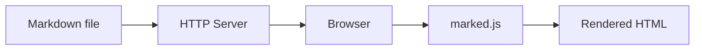
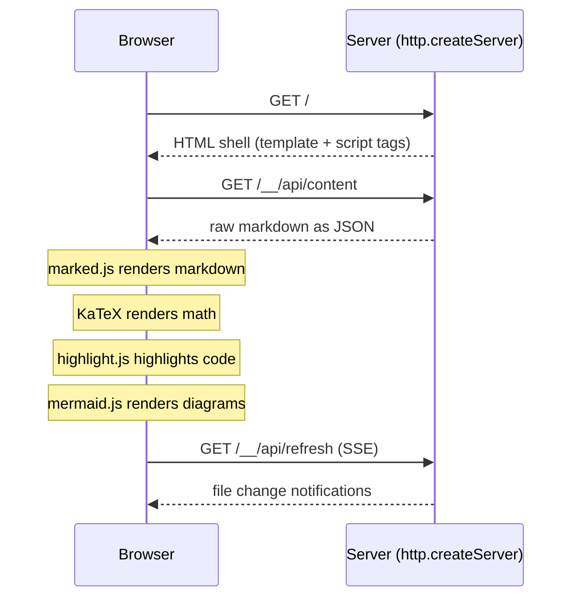

# Markdraft

Preview local markdown files in the browser with GitHub-flavored
rendering, mermaid diagrams, math, syntax highlighting, and live
reload. Zero runtime dependencies.

```console
$ draft README.md
 * Serving on http://localhost:6565/
```


## Installation

### From npm

```console
npm install -g markdraft
```

Or with [pnpm](https://pnpm.io/):

```console
pnpm add -g markdraft
```

Requires Node.js 20+. On first run, markdraft downloads about 3.5 MB
of JavaScript libraries from [jsDelivr](https://www.jsdelivr.com/)
and caches them in `~/.markdraft/`.


## Usage

Preview a file:

```console
$ draft README.md
 * Serving on http://localhost:6565/
```

Preview a directory (serves its README.md):

```console
$ draft .
```

Open the browser automatically:

```console
$ draft -b README.md
```

Specify host and port:

```console
$ draft README.md 0.0.0.0:8080
```

Export to a self-contained HTML file:

```console
$ draft --export README.md
Exporting to README.html
```

Export with CDN links instead of inlined assets:

```console
$ draft --export --no-inline README.md
```

Dark mode:

```console
$ draft --theme=dark README.md
```

The `mdraft` command is also available as an alias, for environments
where `draft` conflicts with
[Azure Draft](https://github.com/Azure/draft).


## Features

- **Live reload** -- file changes are detected and the browser
  refreshes automatically via Server-Sent Events
- **Mermaid diagrams** -- ` ```mermaid ` fenced code blocks rendered
  by [mermaid.js](https://mermaid.js.org/)
- **Math/LaTeX** -- `$inline$` and `$$display$$` math rendered by
  [KaTeX](https://katex.org/)
- **Syntax highlighting** -- code blocks highlighted by
  [highlight.js](https://highlightjs.org/)
- **Source file preview** -- visiting a non-markdown source file
  (`main.rs`, `app.py`, ...) renders it as a highlighted code block
- **GitHub Alerts** -- `> [!NOTE]`, `> [!TIP]`, `> [!IMPORTANT]`,
  `> [!WARNING]`, `> [!CAUTION]` styled callout boxes
- **GeoJSON maps** -- ` ```geojson ` and ` ```topojson ` rendered as
  interactive maps by [Leaflet](https://leafletjs.com/)
- **STL 3D models** -- ` ```stl ` rendered as rotating 3D views by
  [Three.js](https://threejs.org/)
- **Task lists** -- `- [x]` and `- [ ]` checkboxes
- **Emoji shortcodes** -- `:rocket:` -> :rocket:, full
  [gemoji](https://github.com/github/gemoji) set (1,800+ shortcodes)
- **GitHub styling** -- rendered with
  [github-markdown-css](https://github.com/sindresorhus/github-markdown-css)
- **Export** -- self-contained HTML files with all assets inlined or
  linked via CDN
- **Zero dependencies** -- no runtime npm dependencies; rendering is
  done client-side by cached JavaScript libraries
- **Auto/dark/light mode** -- follows OS preference by default
  (`--theme=auto`), or force with `--theme=dark` / `--theme=light`


## Rendering Showcase

The examples below exercise every client-side rendering feature.
Running `draft README.md` and checking that each one renders
correctly is a quick smoke test for a new installation.

### Syntax highlighting

```python
def fibonacci(n: int) -> int:
    a, b = 0, 1
    for _ in range(n):
        a, b = b, a + b
    return a
```

### Mermaid diagrams



### Math / LaTeX

Euler's identity: $e^{i\pi} + 1 = 0$

The Gaussian integral:

$$\int_{-\infty}^{\infty} e^{-x^2} \, dx = \sqrt{\pi}$$

### GitHub Alerts

> [!NOTE]
> This is a note -- useful for supplementary information.

> [!TIP]
> This is a tip -- helpful advice for the reader.

> [!IMPORTANT]
> This is important -- key information the reader should know.

> [!WARNING]
> This is a warning -- something that could cause problems.

> [!CAUTION]
> This is a caution -- potential for data loss or security risk.

### GeoJSON maps

```geojson
{
  "type": "FeatureCollection",
  "features": [
    {
      "type": "Feature",
      "geometry": {
        "type": "Polygon",
        "coordinates": [[
          [-122.42, 37.78], [-122.42, 37.77], [-122.41, 37.77],
          [-122.41, 37.78], [-122.42, 37.78]
        ]]
      },
      "properties": { "name": "San Francisco" }
    }
  ]
}
```

### Emoji shortcodes

:rocket: :sparkles: :warning: :bug: :white_check_mark: :x:
:heart: :star: :fire: :eyes: :tada: :construction:

### Task lists

- [x] Syntax highlighting
- [x] Mermaid diagrams
- [x] Math / LaTeX
- [x] GitHub Alerts
- [x] GeoJSON maps
- [x] Task lists
- [x] Emoji shortcodes

### Tables

| Library      | Purpose             | Size   |
|--------------|---------------------|--------|
| marked.js    | Markdown rendering  | 40 KB  |
| highlight.js | Syntax highlighting | 40 KB  |
| KaTeX        | Math rendering      | 270 KB |
| mermaid.js   | Diagrams            | 2.9 MB |


## Source File Preview

Visiting a file that isn't markdown but is a recognized source file
renders it as a single highlighted code block instead of interpreting
it as markdown. `draft src/main.rs` and clicking `app.py` in a
directory listing both work; so does `--export`.

The file's contents are wrapped server-side in a fence tagged with the
matching highlight.js language, so the client renderer needs no special
case: highlighting, live reload and export all behave exactly as they
do for a code block written by hand. A file that itself contains a line
of backticks gets a longer fence, so its contents are always quoted
verbatim.

Recognized files are listed in `src/source.ts`: about 100 extensions
(`.rs`, `.py`, `.go`, `.rb`, `.ts`, `.sql`, `.yaml`, ...) plus a few
extensionless names (`Makefile`, `Dockerfile`, `Gemfile`,
`CMakeLists.txt`). They also show up in directory listings and in the
sibling-file nav, alongside markdown files.

Anything not on that list is untouched and still renders as markdown --
including `.md`/`.markdown`, plain `.txt`, and extensionless files.
Images, fonts and other binary types are served as before.

To add or override an extension, give it to a `HIGHLIGHT_LANGUAGES`
entry (see below). An extension mapped to a language highlight.js
doesn't actually ship still renders as a code block -- highlight.js
falls back to auto-detection for a fence language it doesn't know.


## CLI Reference

```
usage: draft [options] [path] [address]
```

| Flag | Description |
|------|-------------|
| `path` | File or directory to render (`-` for stdin) |
| `address` | `host:port` to listen on, or output file for `--export` |
| `-b, --browser` | Open browser tab after server starts |
| `--export` | Export to HTML file instead of serving |
| `--no-inline` | Use CDN links instead of inlining assets in export |
| `--title TITLE` | Override the page title |
| `--theme THEME` | Color theme: `auto` (default), `light`, or `dark` |
| `--user-content` | Render as GitHub issue/comment style |
| `--wide` | Wide layout (with `--user-content`) |
| `--norefresh` | Disable auto-refresh on file change |
| `--quiet` | Suppress terminal output |
| `--clear` | Clear the cached assets and exit |
| `-V` | Show version and exit |


## Node.js API

```typescript
import { serve, exportFile, clearCache } from "markdraft";

// Start a preview server
await serve("README.md", { port: 8080, browser: true });

// Export to HTML
await exportFile("README.md", { outFilename: "preview.html" });

// Clear cached CDN assets
await clearCache();
```


## Configuration

Create `~/.markdraft/settings.json` to override defaults:

```json
{
  "HOST": "0.0.0.0",
  "PORT": 8080,
  "AUTOREFRESH": true,
  "QUIET": false
}
```

The `MARKDRAFT_HOME` environment variable overrides the config
directory (default `~/.markdraft`).

### Custom syntax highlighting (`HIGHLIGHT_LANGUAGES`)

Markdraft renders code fences with [highlight.js](https://highlightjs.org/)
v11, which only ships the languages bundled with the CDN build. To highlight
a fenced language highlight.js doesn't know about, register your own
highlight.js language definer via `HIGHLIGHT_LANGUAGES` in
`~/.markdraft/settings.json`:

```json
{
  "HIGHLIGHT_LANGUAGES": [
    {
      "name": "ken",
      "path": "/workspaces/ken/tooling/highlight-js/ken.js",
      "global": "hljsDefineKen",
      "extensions": [".ken"]
    }
  ]
}
```

Each entry:

- `name` (required) -- the highlight.js language name/alias, i.e. what a
  ` ```name ` fence matches.
- `path` (required) -- path to the language definer JS file. A relative
  path is resolved against the config directory (`~/.markdraft`, or
  `MARKDRAFT_HOME`); an absolute path is used as-is.
- `global` (optional) -- the `window` global the file assigns its definer
  function to, for a plain `<script>` that doesn't call
  `hljs.registerLanguage` itself. Omit this for a file that self-registers,
  such as most official highlight.js CDN language files.
- `extensions` (optional) -- file extensions to preview as this language,
  as described under [Source File Preview](#source-file-preview). Each is
  lowercased and given a leading dot, so `"ken"` and `".Ken"` are the same
  entry, and is matched against a file's extension or, for a file with no
  extension, its whole name (so `"justfile"` matches `Justfile`). These
  take precedence over Markdraft's built-in table, so listing `".h"` here
  re-points `.h` files from C to your language.

A malformed entry (missing/wrong-typed `name` or `path`, a non-string
`global`, or a non-array `extensions`) is dropped silently at
config-parse time; an unusable item within `extensions` (empty, or
containing whitespace or a path separator) is skipped on its own. A
well-formed entry whose file can't be found at render time is skipped
with a `console.warn` (unless `QUIET` is set) rather than crashing the
preview. Markdraft doesn't know anything about any specific language --
Ken is just an example consumer of a generic facility; register any
highlight.js-compatible definer the same way.

Only `name` and `path` are needed to highlight a ` ```name ` fence written
by hand; `extensions` is what additionally makes files of that language
render as source when visited.

Both the live server and `--export` inject the configured language(s) after
`highlight.min.js` and before Markdraft's own renderer script runs, so
`hljs.getLanguage(name)` is already true by the time a fence is highlighted.
A file with `global` set gets an additional
`hljs.registerLanguage(name, window[global])` call; a self-registering file
just gets loaded.


## Architecture

Markdraft is a thin HTTP server built on Node's `http.createServer`.
It serves raw markdown via a JSON API and lets the browser handle
all rendering:



Modules:

| Module        | Purpose                                |
|---------------|----------------------------------------|
| `server.ts`   | HTTP server with routing               |
| `readers.ts`  | File/directory/stdin reading           |
| `assets.ts`   | CDN asset downloading and caching      |
| `export.ts`   | Self-contained HTML export             |
| `watcher.ts`  | File change detection for auto-refresh |
| `browser.ts`  | Browser tab opening                    |
| `config.ts`   | Constants, CDN URLs, settings loader   |
| `source.ts`   | Source file extension/language mapping |
| `cli.ts`      | CLI argument parsing                   |


## Development

```console
git clone https://github.com/imofftoseethewizard/markdraft
cd markdraft
pnpm install
pnpm test                # vitest
pnpm run typecheck       # tsc --noEmit
pnpm run lint            # eslint
pnpm run format          # prettier
```


## Acknowledgments

Markdraft began as a fork of [Grip](https://github.com/joeyespo/grip)
by [Joe Esposito](https://github.com/joeyespo). Grip is a
well-crafted tool for previewing GitHub-flavored markdown locally,
and its reader abstractions and CLI design informed markdraft's
architecture.

This is a TypeScript/Node.js port of the
[Python original](https://github.com/imofftoseethewizard/markdraft).

### Major changes from Grip

- **Zero runtime dependencies** -- Grip depends on Flask, Markdown,
  Pygments, requests, docopt, path-and-address, and Werkzeug.
  Markdraft has no npm runtime dependencies; it uses only the
  Node.js standard library.
- **Client-side rendering** -- Grip renders markdown server-side
  with Python. Markdraft serves raw markdown and renders it in the
  browser with [marked.js](https://github.com/markedjs/marked),
  [highlight.js](https://github.com/highlightjs/highlight.js), and
  [mermaid.js](https://github.com/mermaid-js/mermaid).
- **Math/LaTeX support** -- `$inline$` and `$$display$$` math via
  [KaTeX](https://katex.org/).
- **GitHub Alerts** -- `> [!NOTE]`, `> [!WARNING]`, etc. rendered
  as styled callout boxes.
- **Mermaid diagram support** -- ` ```mermaid ` fenced code blocks
  rendered as diagrams.
- **GeoJSON maps and STL 3D models** -- interactive maps via
  Leaflet, rotating 3D model views via Three.js.
- **Security hardening** -- path traversal protection, symlink
  escape prevention, case-insensitive `</script>` escaping in
  exports.
- **GitHub API removed** -- Grip's primary mode was to POST
  markdown to the GitHub API for rendering. Markdraft renders
  entirely offline.


## License

MIT
